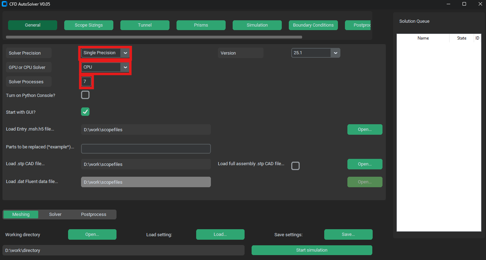
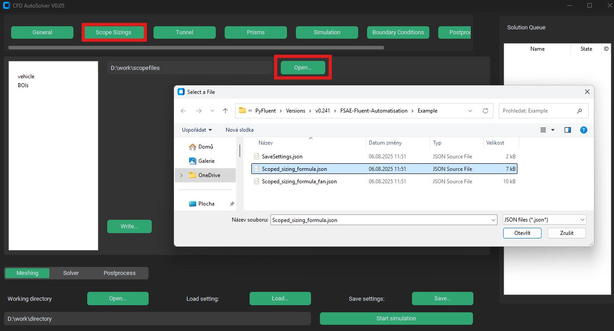

.. _first_project:

First AutoFluent project
========================
First project can be an included template formula with sizing. Through this we can show entire process of starting a simulation.

Working directory setup
^^^^^^^^^^^^^^^^^^^^^^^
At the start of every project it is important to setup your working directory. To this directory will fluent write all save files, transcripts as well as all results.
We can either write tha path to our desired directory into a text file or we can navigate to it (or create it) through explorer window by pressing on **Open...** button
next to a **Working directory** text.

.. image:: ../_static/Work_dir.png
  :width: 450

CAD import
^^^^^^^^^^
There are two ways to import CAD file into AutoFluent, partial and full. Here we are gonna import a full CAD, meaning the CAD file contains the entire car geometry and
Bodies Of Influence. First a **Load full assembly .stp CAD file...** check has to be activated. This switches to full CAD import. Then through **Open...** button or py pasting 
the path to a .stp file choose the **formula.stp** file located in the **Example** folder. 

.. image:: ../_static/Cad_import.png
  :width: 450

System settings
^^^^^^^^^^^^^^^
As every computer has different specifications, we have to set apropriate system settings. These include number of aviable nodes (cores) and wether we want 
to simulate on CPU or GPU (only for high-end computaional GPUs). First choose number of solver processes which is smaller than number of CPU cores in your computer
and then depending on your GPU and RAM (or GPU RAM) set precision and type of solver (single precision uses much less RAM with negligible influence on precision).

Mesh sizing
^^^^^^^^^^^

We can either specify scoped sizing directly in GUI or load a .json file containing all mesh sizing iformations. In **Example** folder there already is such file
which has all mesh setting properly named according to STEP file tree (details in User Guide) so we can use that. In top select menu go to **Scoped sizing** menu and press 
**Open...** button. In expoler go to example folder and choose **Scoped_sizing_formula.json** file. In left sidebar you can see a tree with mesh sizings. Feel free to compare
it with a CAD tree. Prisms settings are also included in said file.

Boundary conditions
^^^^^^^^^^^^^^^^^^^
In top select menu **Boundary conditions** tab we can chose inlet air velocity, wheel diameter and wheel base. These can be left as default. Since we loaded scoped sizing 
without fans, we need to disable fans in our computation. Uncheck the **Simulate fan?** check. Also feel free to try leaving it on, but remember to select a **Scoped_sizing_formula_fan.json**
sizing file.

.. image:: ../_static/Fan_off.png
  :width: 450

Additional settings
^^^^^^^^^^^^^^^^^^^
As it is, the simualtion is ready to be sent for computing, since all the default values are set for the example model. We might be compelled to change some settings though.

# of iterations
"""""""""""""""
By default the number of iterations is set to 1500. This might be unecessary high and its decrease could reduce the computation time drastically, especially if you computate 
on slow CPU. In top select menu go to **Simulation** menu and change the value next to **Number of iterations** text. Here we can also change turbulence settings and temporal 
settings.

.. image:: ../_static/Sim_sett.png
  :width: 450

Postprocessing
""""""""""""""
By default the postprocessing creates 5 .AVZ scenes and **444!!!** cuts (pictures). This takes a lot of time so feel free to reduce the number of cuts or disable some 
types of cuts.

.. image:: ../_static/Postpro_sett.png
  :width: 450

Start calculation
^^^^^^^^^^^^^^^^^
After finishing setting up of simulation we can push theese settings to simulation queue by pressing **Start simulation** buttn. If there is place for it 
(as it should with our first project) the case will quicly change from *waiting* status to *meshing* status and Fluent instance will be created.
If all dependencies are installed and all settings set properly, entire simulation should run from start to end and in working directory results folder will be created.

.. image:: ../_static/Start_sim.png
  :width: 450

