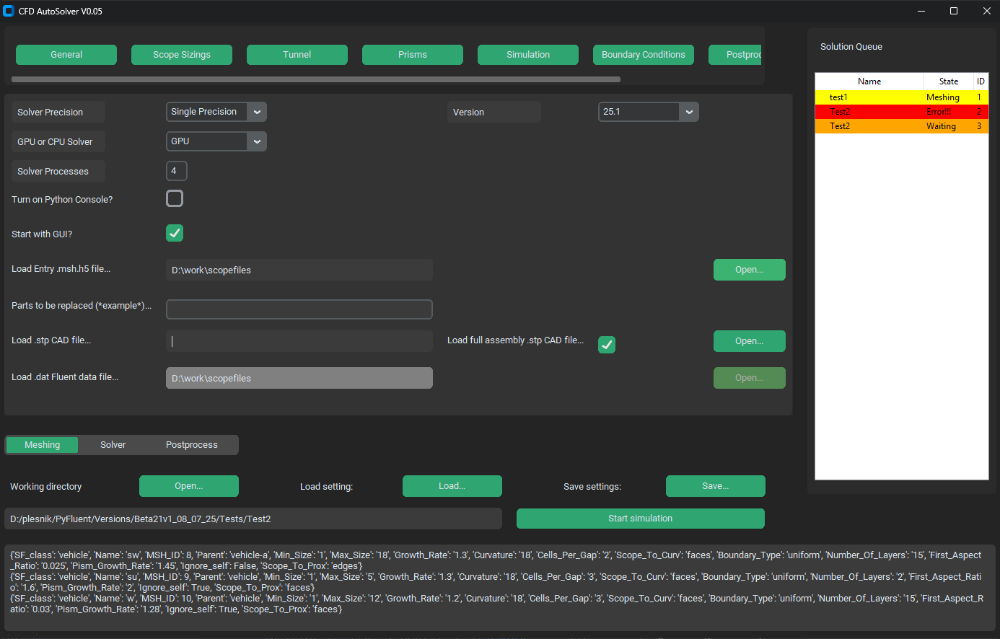
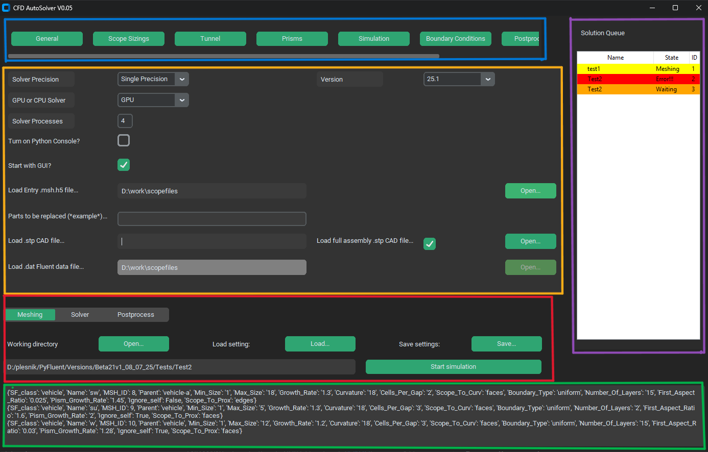

.. _getting_started:

.. raw:: html

   

.. role:: red

.. raw:: html

   

.. role:: blue

.. raw:: html

   

.. role:: yellow

.. raw:: html

   

.. role:: green

.. raw:: html

   

.. role:: purple

Getting Started with AutoFluent
===============================

.. vale Google.Spacing = NO

.. vale Google.Spacing = YES

Downloading AutoFluent
----------------------
User can either download entire branch from `gitHub web <https://github.com/plesnja1/FSAE-Fluent-Automatisation>`_ or pull the branch from git.

.. code-block:: console

   git clone https://github.com/plesnja1/FSAE-Fluent-Automatisation.git

Dependend libraries
-------------------

AutoFluent is dependend on these external libraries that need  to be installed prior:

- **customtkinter**
- **PIL**
- **ansys.fluent.core**
- **ansys.geometry.core**
- **pint**
- **openpyxl**
- **numpy**
- **pandas**

which you can all instal through:

.. code-block:: console

   pip install <library name>

Starting AutoFluent
----------------------
To use AutoFluent a Python 3.8 or higher needs to be installed. Inside a downloaded folder a Main.py script is located. 
If started throug Python a graphical user interface will appear.

Navigating Graphical User Interface
-----------------------------------

GUI is divided into 5 distincted areas. Top select menu (:blue:`Blue`) switches between different options menus. 
Middle large window (:yellow:`Yellow`) is where options menus are shown.
Bottom static menu (:red:`Red`) is for general settings as working directory, solver stage, settings presets and starting simulation.
Right side bar (:purple:`Purple`) is a visualisation of a solution queue.
On bottom (:green:`Green`) is a transcript from a console. 

.. toctree::
   :maxdepth: 2
   :hidden:

   
   first_project